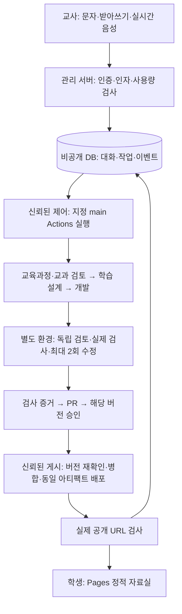

# 시스템 구조 — 01단계 설계

2026-09-13. 이 문서는 구현 계약이다. 앱·DB·워크플로·외부 연결은 아직 없다. 기존 [SYSTEM_SPEC](SYSTEM_SPEC.md) v3.0과 [OWNER_INPUT](OWNER_INPUT.md)을 유지한다.

## 구성과 책임

| 구성 | 책임 | 보관하거나 실행하지 않는 것 |
|---|---|---|
| GitHub Pages / apps/catalog | 한국어 자료실, 학년·단원·검색, 승인된 정적 시뮬레이션 | 학생 로그인·개인정보·학생용 AI 호출·서버 키 |
| Vercel / apps/studio | Next.js 교사 로그인, 문자·음성 입력, 작업 조회·승인, 제한된 서버 API | 긴 제작 작업, 인증 origin에서 후보 코드 실행 |
| Supabase Auth / Postgres | 교사 인증, 소유자별 대화·작업·검토·승인·배포 기록 | 학생 정보, 공개 Git용 원문 요청, 원본 음성 기본 저장 |
| GitHub Actions / automation | 지정 main의 제어 코드, 역할별 제작, 격리 검사, 배포 증거 | 비공개 교과서·개인 메모를 public 로그/PR로 이동 |
| OpenAI API / Codex | 대화 인자 제안, 역할별 제작·검토, 전사·실시간 음성 | 인증·정책·승인·게시 성공 여부의 최종 판정 |

저장소는 하나, 공개 자료실과 관리 제작실은 별도로 배포한다. 공개 가능한 파일만 저장소에 올린다. 이름은 가안을 유지하고 실제 저장소 소유자·URL·요금제는 미확인이다. Pages의 정적 아티팩트 배포와 Vercel의 프로젝트별 Root Directory 구성을 공식 문서에서 확인했으며, 실제 설정은 04·06단계에서 한다. [Pages 공식 문서](https://docs.github.com/en/pages/getting-started-with-github-pages/using-custom-workflows-with-github-pages), [Vercel 모노레포](https://vercel.com/docs/monorepos)



DB 작업은 브라우저 연결과 독립적으로 유지된다. 대화 창에 보이는 상태는 DB의 실제 이벤트를 조회한 결과이며, 스트리밍 문장이나 진행률 추측이 아니다. 이 흐름은 설계이며 현재 실행된 흐름이 아니다.

## 최소 파일 배치

다음 트리는 목표 구조다. 01단계에서 만드는 것은 Markdown 문서뿐이다. `apps`, `packages`, `content`, `tests`, `supabase`, 워크플로 및 패키지 파일은 해당 구현 단계에서 생성한다.

```text
science-simulations/
  README.md / AGENTS.md / .gitignore
  package.json                 # 02: private npm workspace 루트
  package-lock.json            # 02: 루트 잠금 파일 한 개
  apps/
    catalog/                   # 02: 정적 자료실, UI·목록 생성
    studio/                    # 05: Next.js 관리 UI·서버
  packages/contracts/          # 02부터: JSON 규격·타입·검증, 서버 비밀 없음
  content/simulations/<id>/     # 03부터: meta.json·index.html·계산·UI·자산
  automation/
    roles/                     # 01: 역할 지침 Markdown
    control/                   # 07: 접수·실행·상태 연결
    checks/                    # 02부터: 신뢰된 검사·경로 제한
    publish/                   # 04부터: 승인 기록·아티팩트·공개 검사
  tests/                       # 02부터: 계약·계산·브라우저·회귀·권한
  supabase/migrations/         # 05: 검토한 DB 변경 이력
  .github/workflows/           # 04부터: 고정된 검사·배포·제작 workflow
  docs/ / references/ / templates/ / config/
  .local/reference/            # 비공개 원문, Git·원격 제작·배포 제외
  .local/evidence/             # 비공개 로컬 실행 기록, Git 제외
  dist/catalog/               # 승인 목록에 포함된 정적 결과만
```

루트 npm workspace 범위는 `apps/*`, `packages/*`다. 아직 없는 `apps/studio`를 설치 전제에 넣지 않는다. 계약 패키지는 두 앱에서 공유하고, catalog가 studio의 서버 코드를 import하지 않는다. 초기 catalog는 HTML·CSS·TypeScript와 DOM/SVG/Canvas를 기본으로 하며 빌드 도구와 라이브러리의 정확 버전은 02단계 공식 지원 범위 확인 후 고정한다. Next.js는 studio에 사용한다. 의존성 버전·루트 잠금 파일을 함께 기록하고 콘텐츠 작업이 바꾸지 못하게 한다.

로컬은 Windows PowerShell을 사용하고 npm 호출은 `npm.cmd`로 한다. 실행 정책은 변경하지 않는다. Actions는 별도 Linux 환경으로 구성하며 셸 명령과 설치 결과를 로컬과 구분한다. 현재 Git 저장소가 아니므로 브랜치·커밋·원격 URL을 가정하지 않는다.

## 신뢰와 권한 경계

1. 교사 브라우저: 로그인 정보로 서버에 요청한다. 콘텐츠 경로·셸·저장소·workflow·사용자 ID를 임의 실행 인자로 전달하지 않는다. 서버는 인증된 사용자와 저장된 설정으로 결정한다.
2. 관리 서버: 이메일/비밀번호 인증, 신규 가입 비활성화, `ALLOWED_USER_IDS`와 소유권 검사를 적용한다. 세션의 단순 디코딩이나 `getSession()`의 user만 신뢰하지 않는다. 서명 검증된 `getClaims()`와 필요 시 최신 사용자 확인을 사용한다. 공개·취소 등 민감 작업에서 현재 허용 목록과 세션 유효성도 재확인한다. [Supabase 서버 인증](https://supabase.com/docs/guides/auth/server-side/creating-a-client?queryGroups=framework&framework=nextjs)
3. DB: 공개 스키마의 RLS와 Data API 접근 권한을 따로 설정한다. 로그인 여부뿐 아니라 각 행의 소유권을 검증한다. 브라우저에 작업 완료·검토·승인·배포 상태의 직접 쓰기 권한을 주지 않는다. 사용자 수정 가능한 metadata를 권한으로 쓰지 않는다. [RLS](https://supabase.com/docs/guides/database/postgres/row-level-security)
4. 신뢰된 제어: 관리 서버만 Supabase secret과 GitHub App 키를 보관한다. App 설치 범위는 지정 저장소 하나, 작업별 최소 권한이다. 제작 AI·생성 코드 검사에 App 키·쓰기 토큰·DB 관리자 권한을 전달하지 않는다. publishable 키와 서버 secret을 구분하고 서버 secret에는 `NEXT_PUBLIC_` 접두사를 금지한다. [Supabase 키](https://supabase.com/docs/guides/getting-started/api-keys)
5. 제작 AI: 허용된 공개 근거와 단일 콘텐츠 작업 영역만 받는다. OpenAI 인증은 신뢰된 호출 계층이 담당한다. 생성 코드를 실행할 검사 환경에는 그 인증 정보도 없다. 권한 분리가 증명되지 않으면 유료 원격 제작을 켜지 않는다.
6. 검사: 기준 main의 검사 코드·허용 경로를 쓰며 후보가 제출한 검사 결과는 참고 자료다. 별도 깨끗한 환경에서 검사하고 키·쓰기 토큰·OIDC 발급 권한·불필요한 네트워크를 제거한다. 설치 스크립트도 후보 코드와 같은 위험으로 취급한다.
7. 보고·게시: 생성 코드 실행 환경과 별도 job이다. 신뢰된 코드만 상태를 제출하고, 서버는 GitHub OIDC와 등록된 실행의 연결을 확인한다. 후보의 report JSON은 통과 증명이 아니다.

콘텐츠 작업의 쓰기 허용은 예약한 `content/simulations/<id>/` 내부로 제한한다. 다른 콘텐츠, 검사, 테스트 기준, 공통 코드, `automation/roles`, `config`, `AGENTS.md`, 패키지/잠금 파일, 워크플로, 권한 변경은 별도 시스템 작업이다. 경로 정규화 후 이탈·절대 경로·심볼릭 링크·하드링크·Windows junction/reparse point·파일 종류·용량을 검사한다. 모델이 요청한 시스템 변경은 제안으로만 반환한다.

출처 검색/가져오기는 별도 제한된 서버 기능이다. http/https만 허용하고 인증 정보가 포함된 URL, localhost·사설·link-local·메타데이터 주소를 차단한다. DNS 해석 결과와 리다이렉트의 매 단계에 같은 검사를 적용하고 횟수·시간·용량을 제한한다. 웹페이지의 지시문은 자료로만 취급하며 작업 권한이나 공개 승인을 부여하지 않는다.

## 공개 버전과 보존

콘텐츠 ID는 제목과 독립된 영구 식별자다. 첫 ID `mendel-inheritance`를 보존한다. 공개 경로는 설정한 base path 아래 `simulations/<id>/index.html`로 하고, 제목 변경으로 URL을 바꾸지 않는다. `/science-simulations/`는 기존 단계의 하위 경로 시험값이며 실제 저장소 이름 확정 시 검증한다.

`meta.stage`는 편집 상태다. 공개 권한은 별도의 신뢰된 승인 기록·콘텐츠 해시·검사 버전·배포 아티팩트로 결정한다. 초안은 카드뿐 아니라 실행 파일도 빌드 출력에서 제외한다. 후보 미리보기는 관리 인증 origin에서 실행하지 않는다. 콘텐츠 중단은 카드 제거와 기존 URL의 안내 페이지 전환을 함께 처리한다.

02단계부터 공개 목록 판정 계약을 구현하되, 승인 기록이 없으면 빈 자료실을 만든다. 05 이전 승인 기록은 신뢰된 시스템 경로의 최소 공개용 승인 목록으로 관리하고, 교사 확인 후 별도 시스템 작업으로만 갱신한다. 05 이후 비공개 DB의 승인에서 신뢰된 게시기가 공개 목록을 산출한다. 기존 기록을 ID·버전과 함께 이관하고 두 출처를 동시에 권위자로 쓰지 않는다. 정확한 기록 규격은 [DATA_CONTRACTS](DATA_CONTRACTS.md)에 정의한다.

승인 전 후보는 별도 비공개 staging에서 빌드·검사한다. 이 결과를 확인해 승인한 뒤, 신뢰된 게시기가 동일 파일을 최종 출력으로 승격한다. staging을 Pages 출력으로 업로드하지 않는다. 기존 정상 콘텐츠와 합친 최종 자료실의 manifest도 승인에 결합하며, 조합이 바뀌면 새 검증 대상으로 삼는다. 공개 승인 파일 자체는 배포 파일 목록에 포함하지 않아 자기 참조 해시를 만들지 않는다.

Git 공개와 Pages 공개는 다른 경계다. 사이트에서 숨긴 초안도 public Git에 커밋하면 공개된다. `.local`, `.env`, 비공개 원문·개인 메모·원본 음성은 Git·로그·PR·아티팩트·배포물에서 제외한다. `.env.example`은 실제 값 없는 이름/설명만 허용한다. 기존 `.gitignore`의 규칙은 확인했지만 현재 저장소가 없어 추적 파일·과거 이력·실제 ignore 작동은 미검증이다. [Git ignore 범위](https://git-scm.com/docs/gitignore)

## 문서 연결

- [DATA_CONTRACTS](DATA_CONTRACTS.md): 콘텐츠·요청·상태·DB·승인 계약
- [IMPLEMENTATION_PLAN](IMPLEMENTATION_PLAN.md): 단계별 산출물·진입/종료 조건
- [VERIFICATION_MATRIX](VERIFICATION_MATRIX.md): 요구사항별 검사와 증거
- [OPERATIONS](OPERATIONS.md): 운영·취소·비용·복구·보존
- [TOOLS](TOOLS.md): 실제 도구 확인 범위와 향후 에이전트 설정
- [역할 지침](../automation/roles/README.md): 역할별 입력·출력·권한
